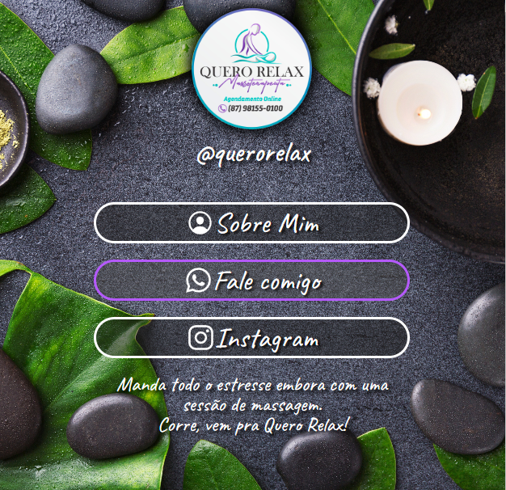

# QueroRelax

<h1 align="center"> Quero Relax LinksHub</h1>

Site Criado para a empresa Quero Relax, com o intuito de facilitar o contato para agendamento.  

  <a href="#-tecnologias">Tecnologias</a>&nbsp;&nbsp;&nbsp;|&nbsp;&nbsp;&nbsp;
  <a href="#memo-licença">Licença</a>

  

 

  

## 🚀 Tecnologias

Esse projeto foi desenvolvido com as seguintes tecnologias:

- HTML e CSS
- Git e Github

## :memo: Licença

Esse projeto está sob a licença MIT.

---
